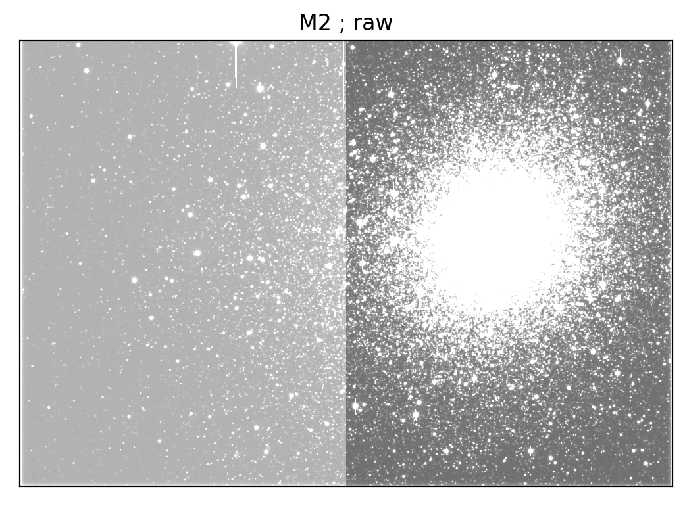

# reduce DECam data using the LSST science pipeline

This pipeline is being developed with Python version Python 3.7.2.



# environment configuration

Add the `decam_reduce/py` directory to your PYTHONPATH. Then you should be able to do stuff like the following:

```
In [1]: import decam_reduce

In [2]: ?decam_reduce
Type:        module
String form: <module 'decam_reduce' from '/home/ameisner/decam_reduce/py/decam_reduce/__init__.py'>
File:        ~/decam_reduce/py/decam_reduce/__init__.py
Docstring:  
decam_reduce
============
A setup for reducing raw DECam images with the LSST pipeline.

In [3]: import decam_reduce.util as util

In [4]: ?util
Type:        module
String form: <module 'decam_reduce.util' from '/home/ameisner/decam_reduce/py/decam_reduce/util.py'>
File:        ~/decam_reduce/py/decam_reduce/util.py
Docstring:  
decam_reduce.util
=================

A collection of DECam reduction related utility functions.
```

If you intend to use an existing local copy of the Pan-STARRS reference catalog shards, then you need to specify the path to them via an environment variable called `PS1_FULLSKY_DIR`, for instance:

```
export PS1_FULLSKY_DIR=$DATA/ps1_pv3_3pi_20170110
```

# dependencies

A `requirements.txt` file has been auto-generated with `pipreqs`. Currently, the necessary dependencies are:

```
astropy
numpy
pandas
requests
setuptools
```

# full pipeline help

    python proc_1night.py --help
    usage: proc_1night.py [-h] [--repo_name REPO_NAME]
                          [--staging_script_name STAGING_SCRIPT_NAME]
                          [--launch_script_name LAUNCH_SCRIPT_NAME]
                          [--multiproc MULTIPROC] [--limit LIMIT]
                          [--filter FILTER] [--propid PROPID]
                          [--do_ps1_download DO_PS1_DOWNLOAD]
                          caldat

    prepare processing for a night of raw DECam data

    positional arguments:
      caldat                observing night in YYYY-MM-DD format

    optional arguments:
      -h, --help            show this help message and exit
      --repo_name REPO_NAME
                            Butler repository name
      --staging_script_name STAGING_SCRIPT_NAME
                            output name for repo staging script
      --launch_script_name LAUNCH_SCRIPT_NAME
                            output name for processing launch script
      --multiproc MULTIPROC
                            number of threads for multiprocessing
      --limit LIMIT         process only first limit exposures
      --filter FILTER       only process raw science data with this filter
      --propid PROPID       only process raw science data with this propid
      --do_ps1_download DO_PS1_DOWNLOAD
                            download PS1 shard files from the internet?
      --bgal_min BGAL_MIN   minimum absolute Galactic latitude in degrees
      --expnum EXPNUM       restrict to a specific exposure number

# example launch script

An example launch script is available as `bin/2018-09-05.sh`.
